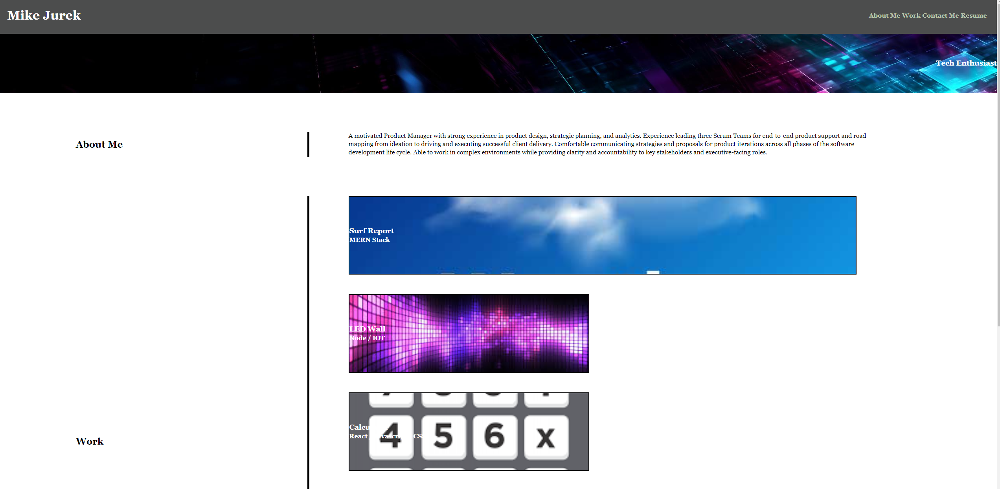

# Professional Portfolio

## Description
My professional portfolio is an application that enables future potential employers or my network to have an easy to navigate way to see projects I have compelted to better understand my capabilities and skill set. As I continue to work on projects across various technology stacks my portfolio will be kept up to date with my progress. 

## Usage
The main user persona of this project is someone looking to learn more about what I have accomplished. The following Acceptance Criteria are supported: 
- WHEN I load their portfolio
THEN I am presented with the developer's name, a recent photo or avatar, and links to sections about them, their work, and how to contact them
- WHEN I click one of the links in the navigation
THEN the UI scrolls to the corresponding section
- WHEN I click on the link to the section about their work
THEN the UI scrolls to a section with titled images of the developer's applications
- WHEN I am presented with the developer's first application
THEN that application's image should be larger in size than the others
- WHEN I click on the images of the applications
THEN I am taken to that deployed application
- WHEN I resize the page or view the site on various screens and devices
THEN I am presented with a responsive layout that adapts to my viewport

The fully functioning application will look like the following: 

## Contributing

I am not accepting contributions at this time, thank you. 